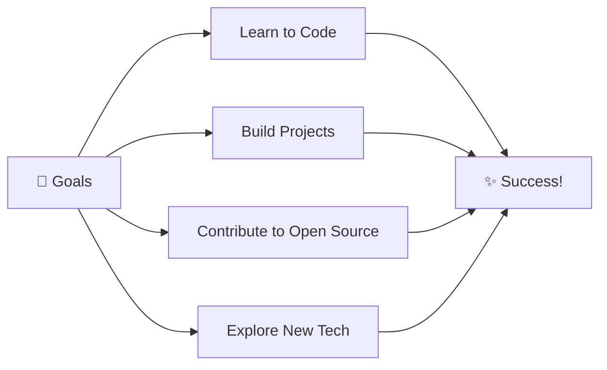

# 🎀 Hi, I'm AJ

### Software Developer | Always Learning

---

## 🎀 About Me

<table>
<tr>
<td>

### 👤 **AJ (@gonzagaav)**
**Status:** 🌸 New to GitHub  

**💖 Interests:**  
`coding` · `design` · `open source` · `continuous learning`

**🌱 Currently:**  
`Exploring technologies` · `Building projects` · `Improving skills`

</td>
</tr>
</table>

### 🌟 My Journey

🎀 New GitHub account  
💖 Learning and improving daily  
✨ Working on projects  
💬 Open to collaboration  
⚡ Driven by curiosity

---

## 🛠️ Skills & Interests

### 🌸 Currently Exploring

### 🎀 Tools

---

## 📊 GitHub Stats

---

## 🏆 GitHub Trophies

---

## 🌸 Welcome to My Journey!

> *"Building something new every day"*  
> *"Learning through doing"*  
> *"Progress over perfection"*

---

## 🎯 Current Goals

---

## 💌 Let's Connect!

---

## 🎨 Daily Inspiration

---

## 📈 Profile Views

### Thanks for stopping by! 🎀

---

### 💖 "Always learning, always growing" 💖

<!--
**gonzagaav/gonzagaav** is a ✨ _special_ ✨ repository because its `README.md` (this file) appears on your GitHub profile.

Here are some ideas to get you started:

- 🔭 I’m currently working on ...
- 🌱 I’m currently learning ...
- 👯 I’m looking to collaborate on ...
- 🤔 I’m looking for help with ...
- 💬 Ask me about ...
- 📫 How to reach me: ...
- 😄 Pronouns: ...
- ⚡ Fun fact: ...
-->
